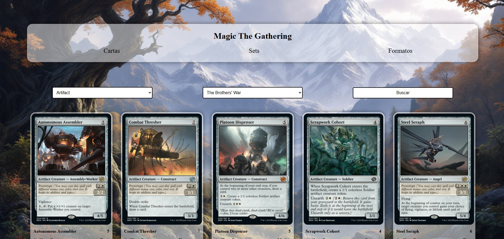
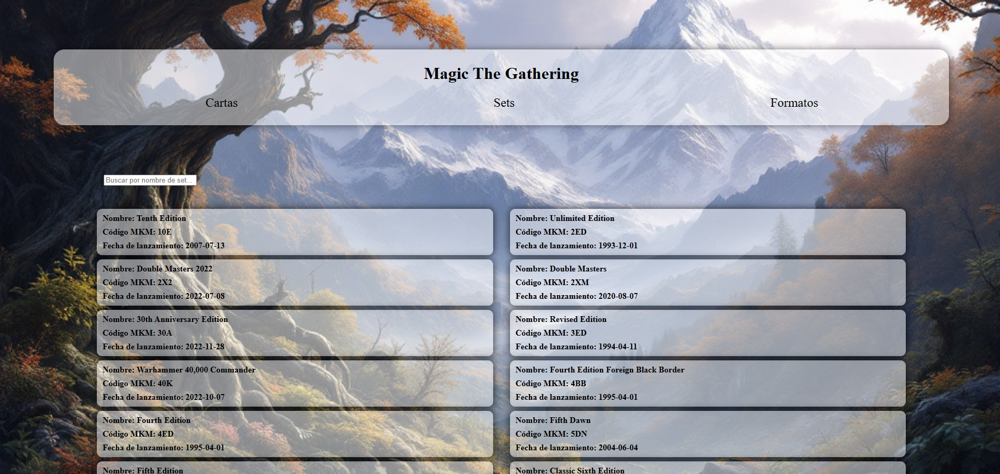
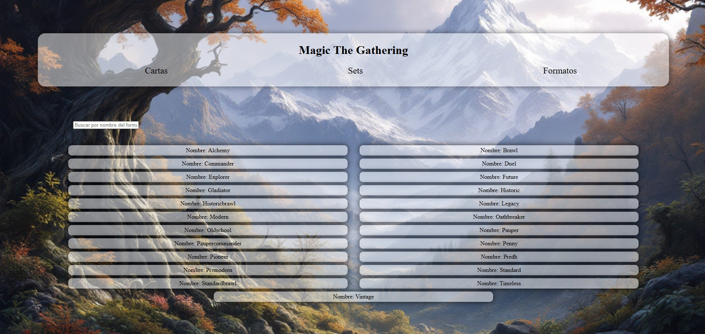

  

# Magic The Gathering API React App

Una aplicación web construida con **React** que interactúa con la API pública de *Magic: The Gathering* para mostrar cartas, sets, tipos y formatos de juego. Con esta app, puedes explorar y buscar información detallada sobre el juego.

## Funcionalidades

- **Búsqueda de cartas**: Filtra cartas por tipo y set.
- **Explorar sets**: Visualiza información sobre los sets disponibles.
- **Explorar formatos**: Muestra los diferentes formatos de juego.
- **Interfaz interactiva**: Filtros dinámicos para visualizar datos relevantes.

## Estructura del Proyecto

- **`src/App.jsx`**: Componente principal que gestiona las rutas y la navegación.
  - **`src/index.css`**: Estilos generales de la aplicación.
- **Componentes**
  - **`src/components/Menu.jsx`**: Barra de navegación para acceder a las diferentes páginas.
    - **`src/components/Menu.css`**: Estilos para el componente Menu.
- **Paginas**
  - **`src/pages/Cartas.jsx`**: Página que permite buscar cartas por tipo y set.
    - **`src/Cartas.css`**: Estilos para la página de cartas.
  - **`src/pages/Sets.jsx`**: Página que muestra los sets de cartas y permite buscarlos.
    - **`src/Sets.css`**: Estilos para la página de sets.
  - **`src/pages/Formatos.jsx`**: Página que muestra los formatos de juego y permite filtrarlos.
    - **`src/Formatos.css`**: Estilos para la página de formatos.

## Dependencias

Este proyecto utiliza las siguientes dependencias:

- `react`: Para la creación de la interfaz de usuario.
- `react-dom`: Para renderizar los componentes en el DOM.
- `react-router-dom`: Para la navegación entre páginas.
- `fetch`: Para realizar peticiones a la API de *Magic: The Gathering*.

## Rutas de la Aplicación

- **`/`**: Página de inicio.
- **`/cartas`**: Buscar y ver cartas.
- **`/sets`**: Buscar y ver sets.
- **`/formatos`**: Buscar y ver formatos de juego.

## API de Magic the Gathering

La aplicación consume la API pública de *Magic the Gathering* para obtener datos.  
API base: [https://api.magicthegathering.io/](https://api.magicthegathering.io/)

## Estructura de los Componentes

### **Componente `App.jsx`**

Gestiona las rutas y la estructura de la aplicación utilizando `react-router-dom`.

### **Componente `Menu.jsx`**

Barra de navegación con enlaces a las diferentes secciones de la aplicación.

### **Componente `Cartas.jsx`**

Permite buscar cartas de *Magic: The Gathering* aplicando filtros por tipo y set.

### **Componente `Sets.jsx`**

Muestra información sobre los sets de cartas y permite buscarlos por nombre.

### **Componente `Formatos.jsx`**

Muestra los formatos de juego disponibles y permite realizar búsquedas.

## Capturas de Pantalla

### Página de Cartas

  
*Buscar cartas filtrando por tipo y set.*

### Página de Sets

  
*Buscar sets filtrando por nombre.*

### Página de Formatos

  
*Ver los formatos de juego disponibles.*

## Licencia

Este proyecto está bajo la licencia **MIT**. Puedes ver los detalles en el archivo `LICENSE`.
